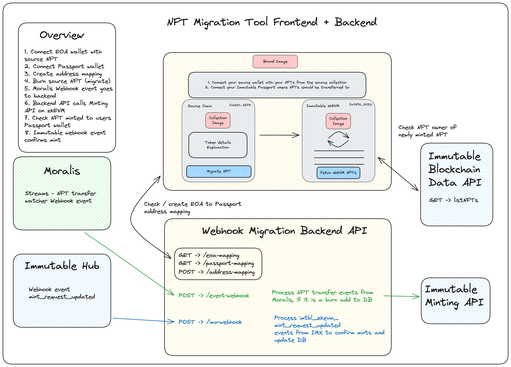

# NFT Token Migration

This project provides the functionality for users to burn tokens on the source chain and have them minted on Immutable zkEVM. It is meant to be used in conjunction with the webhook backend migration repo [here]().

## Disclaimer

The sample code provided is for reference purposes only and is not officially supported by Immutable. It has undergone best effort testing by Immutable to ensure basic functionality. However, it is essential that you thoroughly test this sample code within your own environment to confirm its functionality and reliability before deploying it in a production setting. Immutable disclaims any liability for any issues that arise due to the use of this sample code. By using this sample code, you agree to perform due diligence in testing and verifying its suitability for your applications.


## Diagram



## Prerequisites

- Node v18, npm v10

## Get Started

Checkout the project branch that you want from above.

Install the latest version of the @imtbl/sdk.

```bash
npm install @imtbl/sdk
npm i
```

This project uses the Web3Modal SDK from WalletConnect to provide a large selection of available wallet connections to the application. This requries a project to be set up in [WalletConnect cloud](https://cloud.walletconnect.com/). Setup an account and a project and copy the projectId.

1. Determine the source/origin chain that the existing NFT contract is deployed on. This is the collection of NFTs that will be burnt (transferred to the burn address) as part of the process.
2. Determie the destination chain that your contract collection is depolyed on. This is the collection where the migrated tokens will be minted.
3. Update the `web3modal` configuration to enable wallets to connect to the source and destination chains. 
  - Go to `src/config/web3modal.ts` and make sure that a chain configuration exists your source (origin) chain for the migration.
  ```ts

  export const polygon = {
    chainId: 137,
    name: 'Polygon',
    currency: 'MATIC',
    explorerUrl: 'https://polygonscan.com/',
    rpcUrl: 'https://polygon-rpc.com'
  }
  export const imtblzkEvmTestnet = {
    chainId: 13473,
    name: 'Immutable zkEVM Testnet',
    currency: 'tIMX',
    explorerUrl: 'https://explorer.testnet.immutable.com',
    rpcUrl: 'https://rpc.testnet.immutable.com'
  }
  ```
  - In `App.tsx` include the source chain in `createWeb3Modal()` function call in the chains array
  ```ts
    createWeb3Modal({
    chains: [polygon],
    // ... other web3modal config
    })
  ```

## Add configuration

Rename .env.example to .env, replace all of the variables with your own project variables from https://hub.immutable.com.

Update all of the site configuration variables accordingly to configure the project to work with your source contract on the origin chain and the destination contract on Immutable zkEVM. These environment variables should match with what you have configured in the backend code.


## User flow

1. Connect EOA wallet which has the tokens to be migrated
2. Connect Passport wallet to migrate your tokens to
3. Link the wallets together
4. Go to the source chain section on the left to see your NFTs
5. Click which token to migrate, if neccessary it will prompt to switch to the origin network/chain
6. Confirm burn transaction in wallet
7. Wait until token is minted on the destination chain on the right

## Start

`npm run dev`

## Passport login flow

After setting up your passport clientId and redirect variables, make sure that you have a route to handle the redirect. The component at this route should use the passport instance to call `loginCallback()`. See PassportRedirect component and how it is added to the React Router in main.tsx.

## Gotchas

In order to build for production, a package `jsbi` had to be installed to support one of the dependencies. The alias had to be added to the resovle section of the `vite.config.ts` file.

## Deployment in Vercel

A `vercel.json` file has been added to help configure for deployments in Vercel. This is not neccessary if you are not deploying to Vercel. It is re-writing all routes back to the index.html file to make the React Router work correctly.

## UI Kit: Chakra UI

- [Chakra UI Docs](https://v2.chakra-ui.com/)
- [Github](https://github.com/chakra-ui/chakra-ui)
- [Additional Examples](https://chakra-templates.vercel.app/)